

  

<h1 align="center">Resonus</h1>

  A clean music player for your self-hosted server, and your local files.
   
  Android, with an experimental iOS build.

---

  
  
  
  
  
  

## Screenshots

| Home | Player | Album | Library |
| :---: | :---: | :---: | :---: |
| 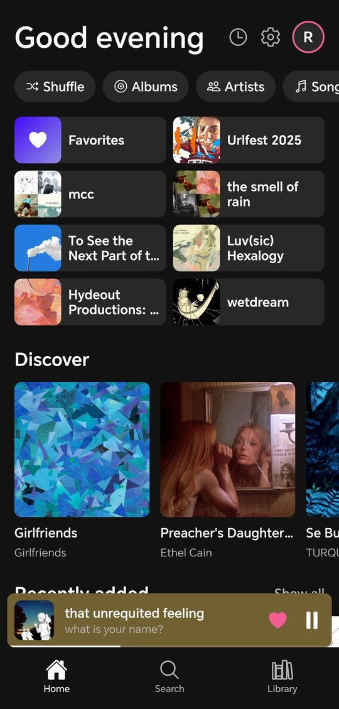 | 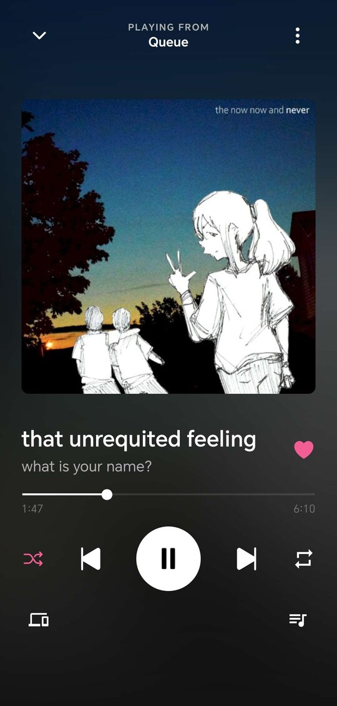 | 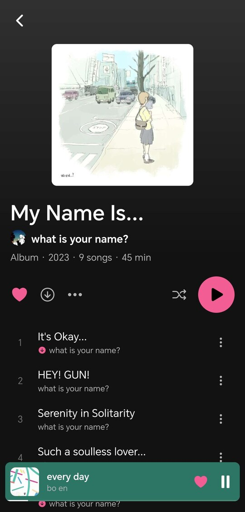 | 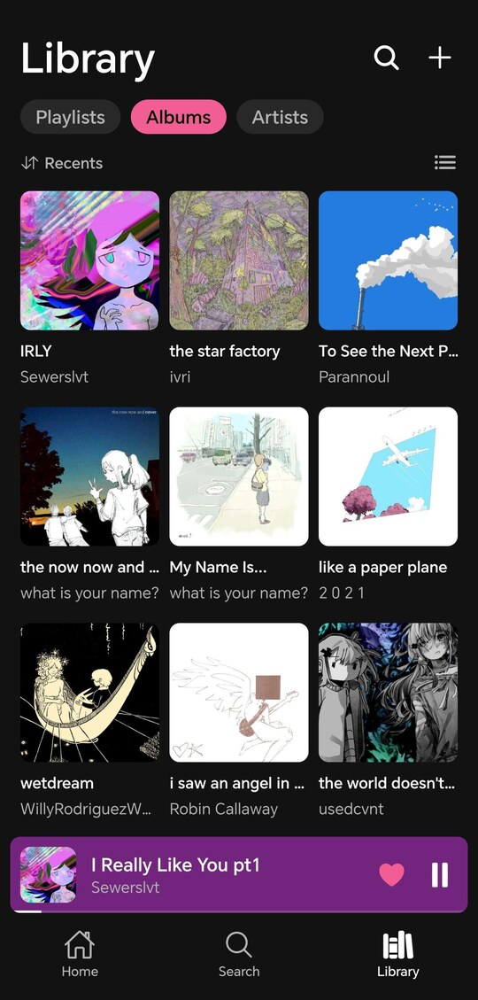 |
| 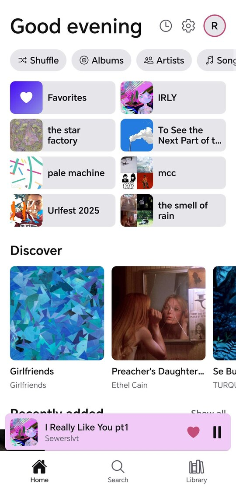 | 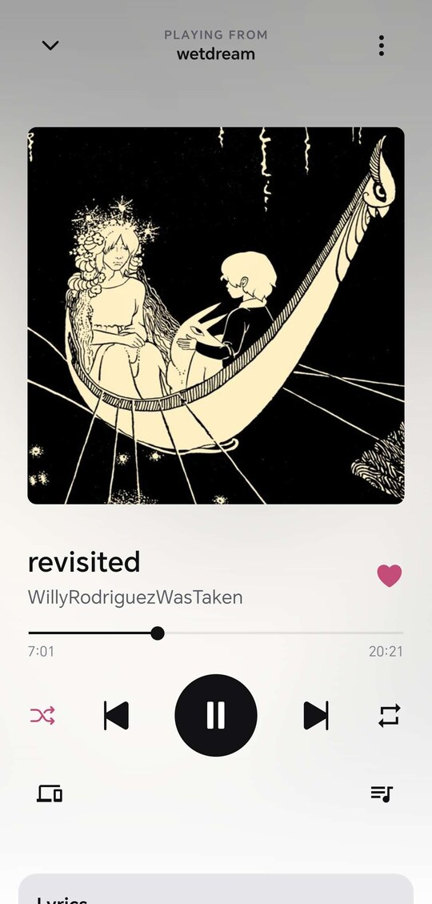 | 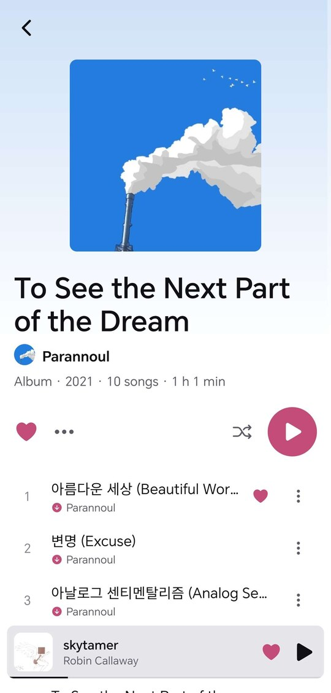 | 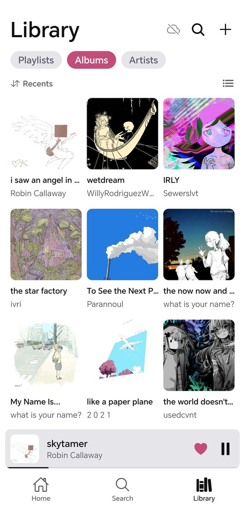 |

| Artist | Lyrics | Queue | Servers |
| :---: | :---: | :---: | :---: |
| 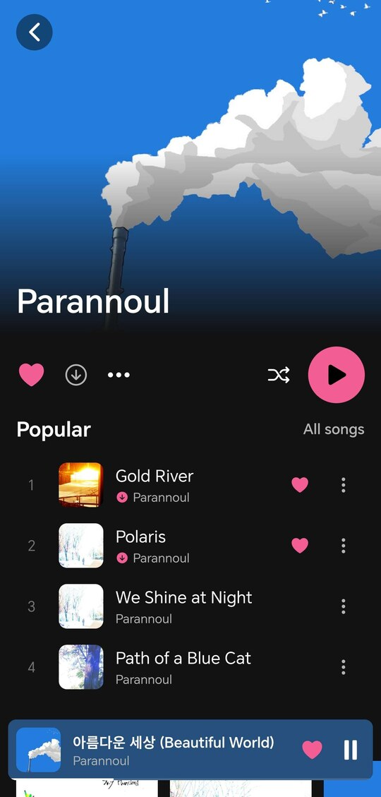 | 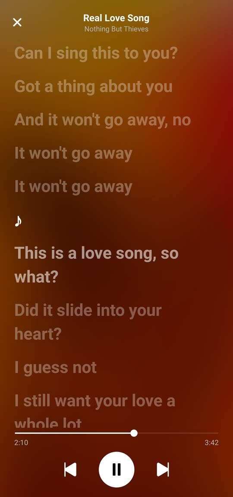 | 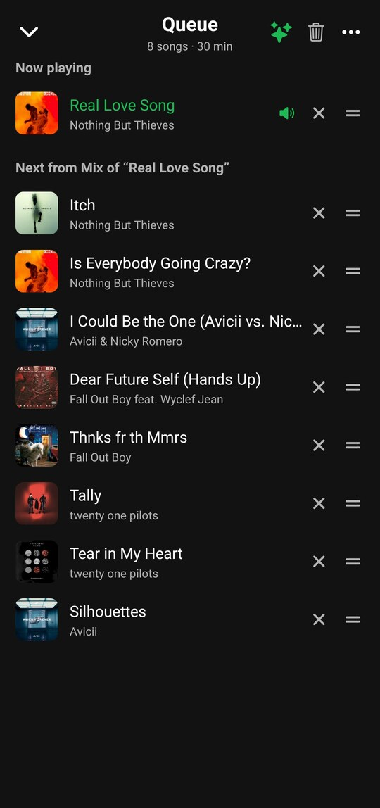 | 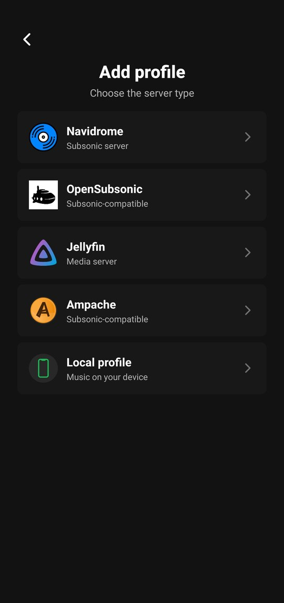 |

## Download

### Android

Get the latest APK from the [Releases](https://github.com/juananzzz/resonus/releases/latest) page and install it on your Android device.

Also available on [Obtainium](https://apps.obtainium.imranr.dev/redirect?r=obtainium://add/https://github.com/juananzzz/resonus) for automatic updates.

### iOS (experimental)

Every release since 0.7.5 also carries an `.ipa`, on the same
[Releases](https://github.com/juananzzz/resonus/releases/latest) page. It is
**unsigned**: no App Store, no TestFlight, so it has to be sideloaded with
AltStore, Sideloadly or similar, and renewed as that tool asks.

Not implemented yet on iOS: CarPlay, casting, the equalizer and gapless
playback.

## Features

- **Navidrome / OpenSubsonic / Jellyfin / Ampache**: multi-profile login, multi-library support, plus several server addresses with automatic switching
- **Local mode**: play music straight from your device or a folder, no server needed
- **Offline mode**: your favorites, playlists and albums stay browsable with no connection; downloaded songs play, the rest show grayed out, and it switches automatically when the server is unreachable
- **Downloads**: albums, playlists, an artist's whole discography or single songs, in original quality or transcoded
- **Synced lyrics**: karaoke view with tap-to-seek, full-screen mode, optional LRCLIB lookup
- **Internet radio**: browse and manage your stations
- **Cast to speakers**: UPnP/DLNA renderers and Sonos, with room grouping; local music streams to them too
- **Playback**: gapless, crossfade, built-in equalizer, ReplayGain normalization, playback speed, sleep timer, queue with undo, shuffle, repeat, background & lock-screen controls
- **Autoplay & mixes**: keep the music going with similar songs, or start a mix from any track
- **Organize**: multi-select (queue, playlist or download in batch), star ratings, pinned items, play history
- **Themes**: dark, light (experimental) or whichever one the phone is on, each with its own accent color
- **Make it yours**: reorder and show/hide Home sections and explore chips, app fonts, configurable swipe and ⋯ menu actions
- **Android Auto** (experimental)
- **Landscape and tablet layouts**
- **Queue sync across devices**
- **In 8 languages**: English, Spanish, German, Catalan, Russian, Italian, Simplified Chinese, Ukrainian

## FAQ

The questions that come up most often are answered in
[docs/FAQ.md](./docs/FAQ.md), starting with how to get Resonus to show up in
Android Auto. The app links to it too, from Settings › About.

## Translations

More languages are welcome via pull request. See
[TRANSLATING.md](./TRANSLATING.md) for how to add one, plus context for the
trickier strings.

Thanks to the people who have translated the app:

| Language | Contributor(s) |
| --- | --- |
| English | [juananzzz](https://github.com/juananzzz) |
| Español | [juananzzz](https://github.com/juananzzz) |
| Deutsch | [Psychotoxical](https://github.com/Psychotoxical), [CraftoHohenvels](https://github.com/CraftoHohenvels) |
| Català | [juananzzz](https://github.com/juananzzz) |
| Русский | [ztx-lyghters](https://github.com/ztx-lyghters) |
| Italiano | [Anakin-bb8](https://github.com/Anakin-bb8) |
| 简体中文 | [xcdmrCHP](https://github.com/xcdmrCHP) |
| Українська | [albedych](https://github.com/albedych) |

## Community

Join the [Discord server](https://discord.gg/pecE8MTPVr) to share feedback,
report bugs, ask questions, or just follow along with development.

## Contributing

Contributions are welcome. See [CONTRIBUTING.md](./CONTRIBUTING.md) for how to
set up the project, run it on an emulator, and open a pull request.

## Support

Resonus is free and open source, built in my spare time. If you enjoy it and
want to help me keep working on it, you can buy me a coffee on
[Ko-fi](https://ko-fi.com/juananzzz).
